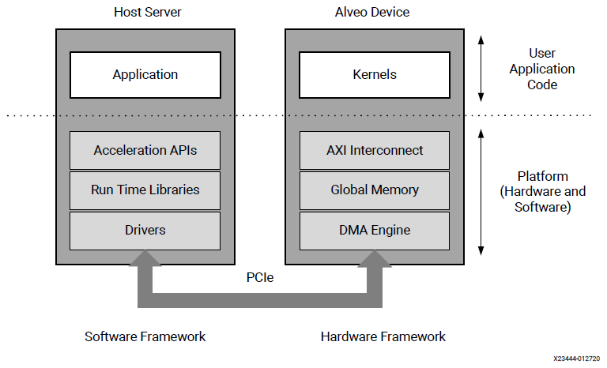

.. include:: include/links.txt
.. include:: include/format.txt

##########################################################################
Alveo Versal Vitis Platforms
##########################################################################

.. # Start of document

.. figure:: media/Xmed.png
   :figwidth: 5%
   :align: left

Xilinx® Alveo® Versal® Data Center accelerator cards are PCI Express® compliant cards designed to accelerate compute-intensive applications such as machine learning, data analytics, and video processing in a server or workstation. The Vitis® core development kit provides verified platforms defining all the required hardware and software interfaces (shown in gray in the following figure), allowing you to design custom acceleration applications (shown in white) that are easily integrated into the `Vitis`_ programming model.

|br|

   **Figure: Vitis Versal Platform System Overview**

For more information on the Alveo Versal Vitis Platform architecture see :ref:`Platform Architecture<arch overview>`.
 
----------------------------------

Available Platforms
*********************

This section outlines the Versal-based accelerator cards for data centers and the available target platforms. A target platform provides the firmware for the accelerator card running in a specific configuration. A target platform must be installed with Xilinx RunTime (`XRT`_).

The following table lists the available target platforms per Alveo Versal data center card. For each platform it details the release name, available :ref:`feature<arch features>`, and tool support. There can be more than one target platform for a given card.

.. table:: **Table: Available Alveo Versal Platforms**

   +---------+-------------------------------------+-----------------------------+--------------------------+
   | Card    | Platform Name                       | Features                    | Tool Support             |
   |         |                                     +-----+-----+-----+-----+-----+--------+--------+--------+ 
   |         |                                     | P2P | HM  | DFX | AIE | GT  | 2021.2 | 2022.1 | 2022.2 |
   +=========+=====================================+=====+=====+=====+=====+=====+========+========+========+
   | VCK5000 | :ref:`vck5000_gen3x16_xdma_base_1`  |     |     | 1RP | Yes | Yes |  Yes   |        |        |
   |         +-------------------------------------+-----+-----+-----+-----+-----+--------+--------+--------+
   |         | :ref:`vck5000_gen4x8_xdma_base_2`   |     |     | 1RP | Yes | Yes |        |  Yes   |        |
   |         +-------------------------------------+-----+-----+-----+-----+-----+--------+--------+--------+
   |         | :ref:`vck5000_gen4x8_qdma_base_2`   |     |     | 1RP | Yes | Yes |        |        |  Yes   |
   +---------+-------------------------------------+-----+-----+-----+-----+-----+--------+--------+--------+
   

.. note:: 
   Only the above Versal-based Alveo platforms are supported. Any Versal-based Alveo card or platform that is not listed is not supported. Xilinx recommends always using the latest platform release.

.. attention::
    
   The 2021.2 VCK5000 Gen3x16 platform is being deprecated. For 2022.1 onwards, please migrate to the Gen4x8 platforms.  
   
   Upgrading the VCK5000 card to the Gen4x8 platforms requires additional steps:
   
   - To install the Gen4x8 XDMA platform on the VCK5000 card please follow the :ref:`VCK5000 migration guide's Stage 1 OSPI migration steps  <VCK5000 Migration Guide>` for important upgrade details.

   - To upgrade the VCK5000 card from Gen4x8 XDMA to Gen4x8 QDMA platform please follow the :ref:`VCK5000 migration guide's Stage 2 QDMA base 2 shell update steps <VCK5000 Migration Guide>` for important upgrade details.

----------------------------------

.. include:: include/license.txt

.. toctree::
   :maxdepth: 3
   :caption: Getting Started
   :hidden:

   docs/getting-started/card_installation.rst
   docs/getting-started/install_development.rst
   docs/getting-started/install_deployment.rst
   docs/getting-started/vck5000_migration.rst

.. toctree::
   :maxdepth: 3
   :caption: Platform Architecture
   :hidden:

   docs/architecture/arch_overview.rst
   docs/architecture/arch_features.rst

.. toctree::
   :maxdepth: 3
   :caption: Platform User Guides
   :hidden:

   docs/user-guide/ug_list.rst
   docs/user-guide/ug_vck5000_gen3x16_xdma.rst
   docs/user-guide/ug_vck5000_gen4x8_xdma.rst
   docs/user-guide/ug_vck5000_gen4x8_qdma.rst

